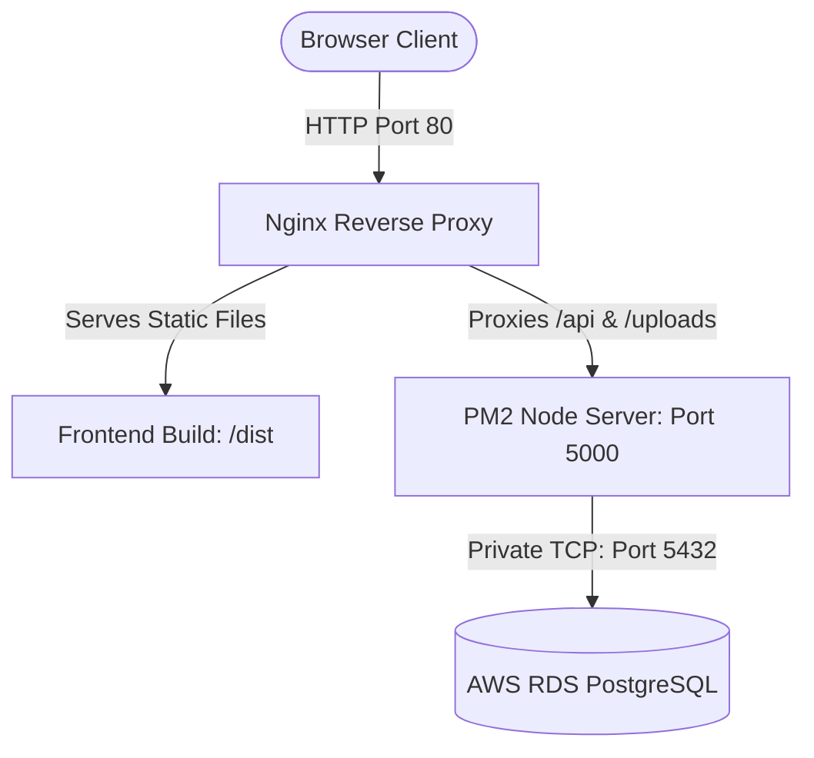

# AWS Deployment Guide: Single-Server EC2 with RDS PostgreSQL

This guide provides step-by-step instructions on deploying the **Shopify Lite** MVP on AWS. 

We will host the frontend (compiled React/Vite code served via Nginx) and the backend (Node.js/Express running via PM2) on a single EC2 instance. The application will connect to an isolated AWS RDS PostgreSQL database.

---

## Architecture Overview



---

## Step 1: Create Security Groups

We need to create two Security Groups: one for the EC2 instance (public web server) and one for the RDS PostgreSQL database.

### 1. EC2 Web Server Security Group (`shopify-lite-ec2-sg`)
1. Go to the **VPC Console** or **EC2 Console** under **Security Groups**.
2. Click **Create security group**.
3. Set Name to `shopify-lite-ec2-sg` and select your VPC.
4. Add the following **Inbound Rules**:
   - **Type**: `SSH` | **Port**: `22` | **Source**: `My IP` (For secure admin SSH access)
   - **Type**: `HTTP` | **Port**: `80` | **Source**: `Anywhere-IPv4` (`0.0.0.0/0`)
   - **Type**: `HTTPS` | **Port**: `443` | **Source**: `Anywhere-IPv4` (`0.0.0.0/0`) *(For future SSL setup)*
5. Click **Create security group**.

### 2. RDS Database Security Group (`shopify-lite-rds-sg`)
1. Click **Create security group**.
2. Set Name to `shopify-lite-rds-sg` and select the **same** VPC.
3. Add the following **Inbound Rule**:
   - **Type**: `PostgreSQL` | **Port**: `5432` | **Source**: Custom -> Type or search for `shopify-lite-ec2-sg` (This allows database access *only* from your EC2 instance).
4. Click **Create security group**.

---

## Step 2: Create AWS RDS PostgreSQL Database

1. Go to the **RDS Console** and click **Create database**.
2. Choose **Standard create**.
3. Engine options: **PostgreSQL**.
4. Engine version: Choose the default recommended version (e.g., PostgreSQL 15 or 16).
5. Templates: Select **Free Tier** (or **Dev/Test** for production workloads).
6. Settings:
   - **DB instance identifier**: `shopify-lite-db`
   - **Master username**: `postgres` (or your preferred username)
   - **Master password**: Enter a secure password and save it somewhere safe.
7. Instance configuration: Choose `db.t3.micro` or `db.t4g.micro` (free tier eligible).
8. Connectivity:
   - **Virtual private cloud (VPC)**: Select the same VPC as your EC2 Security Group.
   - **Public access**: Select **No** (highly recommended for security; it prevents direct connections to your database from the public internet).
   - **Existing VPC security groups**: Select `shopify-lite-rds-sg` and remove the `default` security group.
9. Additional configuration (Expand this section):
   - **Initial database name**: `shopify_lite`
10. Click **Create database**. This takes about 5–10 minutes.
11. Once created, click on `shopify-lite-db` to view details and copy the **Endpoint** (e.g., `shopify-lite-db.c123456789.us-east-1.rds.amazonaws.com`).

---

## Step 3: Configure AWS Secrets Manager & IAM Role

Instead of hardcoding database credentials and JWT secrets inside the User Data script, we store them securely in **AWS Secrets Manager** and fetch them dynamically at boot.

### 1. Create Secret in AWS Secrets Manager
1. Open the **AWS Secrets Manager Console** and click **Store a new secret**.
2. Select **Other type of secret**.
3. Under **Key/value pairs**, add the following keys and their production values:
   - **`DATABASE_URL`**: `postgresql://<USERNAME>:<PASSWORD>@<RDS_ENDPOINT>:5432/shopify_lite`
   - **`JWT_SECRET`**: A long, secure random key.
   - **`JWT_EXPIRES_IN`**: `7d` (optional, defaults to `7d` if omitted)
   - **`PORT`**: `5000` (optional, defaults to `5000` if omitted)
   - **`FRONTEND_URL`**: `*` (optional, defaults to `*` if omitted)
4. Click **Next**.
5. Set the **Secret name** to `shopify-lite-prod-secrets`.
6. Click **Next** through the remaining screens and click **Store**.

### 2. Create IAM Policy and Role for EC2
The EC2 instance needs permission to fetch this secret from AWS Secrets Manager.
1. Open the **IAM Console** and go to **Policies** -> **Create policy**.
2. Click the **JSON** tab and paste the following policy:
   ```json
   {
       "Version": "2012-10-17",
       "Statement": [
           {
               "Sid": "RetrieveSecrets",
               "Effect": "Allow",
               "Action": "secretsmanager:GetSecretValue",
               "Resource": "arn:aws:secretsmanager:*:*:secret:shopify-lite-prod-secrets-*"
           }
       ]
   }
   ```
3. Click **Next: Tags** -> **Next: Review**. Name the policy `shopify-lite-secrets-policy` and click **Create policy**.
4. Go to **Roles** -> **Create role**.
5. Select **AWS service** and select **EC2** as the common use case. Click **Next**.
6. Search for and check the box next to `shopify-lite-secrets-policy` (and `AmazonSSMManagedInstanceCore` if you want to connect via AWS Session Manager). Click **Next**.
7. Name the role `shopify-lite-ec2-role` and click **Create role**.

### 3. Configure User Data Script Variables
Open the [user-data.sh](file:///Users/bot/Downloads/Projects/ShopifyMVP/deployment/user-data.sh) file and update the variables at the top of the script:
1. **`REPO_URL`**: Update this to your Git repository URL.
2. **`SECRET_NAME`**: Set to the name of your secret (default is `shopify-lite-prod-secrets`).
3. **`AWS_DEFAULT_REGION`**: Set to the AWS region where your database and secret reside (e.g., `us-east-1`).

---

## Step 4: Create EC2 Launch Template & Launch Instance

1. Go to the **EC2 Console** -> **Launch Templates** -> **Create launch template**.
2. Name the template: `shopify-lite-launch-template`.
3. Application and OS Images (AMI): Choose **Ubuntu 22.04 LTS (HVM), SSD Volume Type** (64-bit x86).
4. Instance type: Select `t2.micro` or `t3.micro` (Free Tier eligible) or larger.
5. Key pair (login): Select an existing SSH key pair or create a new one to enable SSH access.
6. Network settings:
   - **Security groups**: Select `shopify-lite-ec2-sg`.
7. Expand **Advanced details**:
   - **IAM instance profile**: Select `shopify-lite-ec2-role` (This is critical to allow your instance to read from Secrets Manager).
   - Scroll down to the bottom to the **User data** box.
   - Paste the contents of your configured [user-data.sh](file:///Users/bot/Downloads/Projects/ShopifyMVP/deployment/user-data.sh) script into this box.
8. Click **Create launch template**.
9. Launch an instance from this template by selecting it and clicking **Launch instance from template**.

---

## Step 5: Verify Deployment and Troubleshooting

Once the EC2 instance launches, the User Data script will run. This setup process typically takes 3 to 5 minutes.

### 1. Monitoring Setup Logs
SSH into your instance and view the real-time logs of the User Data execution script:
```bash
ssh -i /path/to/your-key.pem ubuntu@<EC2_PUBLIC_IP>
tail -f /var/log/user-data.log
```
Look for `"=== Deployment script completed ==="` at the end of the log.

### 2. Check Backend Server Status
Check if the backend process is running successfully via PM2:
```bash
sudo -u ubuntu pm2 status
sudo -u ubuntu pm2 logs shopify-lite-backend
```

### 3. Check Nginx Web Server
Check if Nginx is running and serving traffic correctly:
```bash
sudo systemctl status nginx
sudo nginx -t
sudo tail -f /var/log/nginx/error.log
```

### 4. Database Seeds (Optional)
If you want to populate the database with initial admin users and categories, navigate to the backend directory and run the Prisma seed script:
```bash
cd /var/www/ShopifyLite/backend
sudo -u ubuntu npx prisma db seed
```

---

## Step 6: Configure SSL/TLS (Optional but Recommended)

For production deployments, configure HTTPS using Let's Encrypt Certbot:

1. Log into your EC2 instance.
2. Install Certbot:
   ```bash
   sudo apt install snapd
   sudo snap install --classic certbot
   sudo ln -s /snap/bin/certbot /usr/bin/certbot
   ```
3. Request and install SSL certificate for Nginx:
   ```bash
   sudo certbot --nginx -d yourdomain.com
   ```
4. Follow the prompts. Certbot will automatically rewrite your Nginx configuration to support HTTPS and redirect HTTP traffic to HTTPS.
